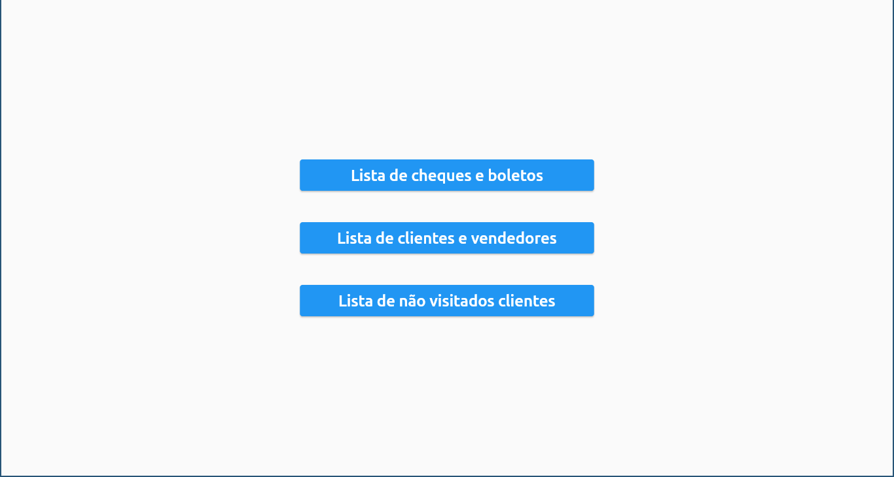
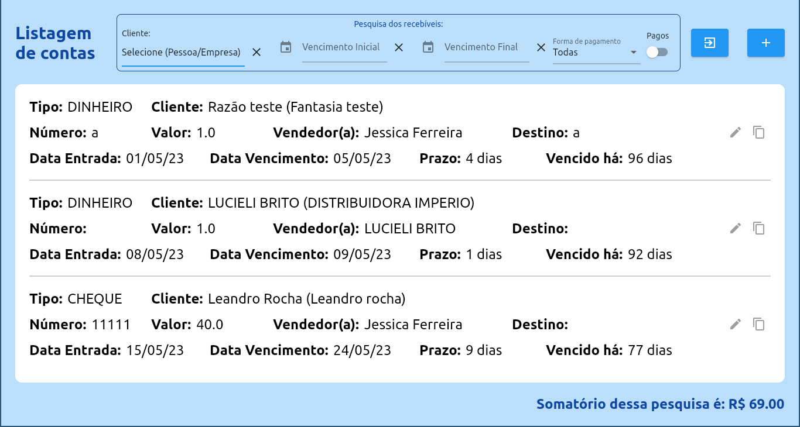
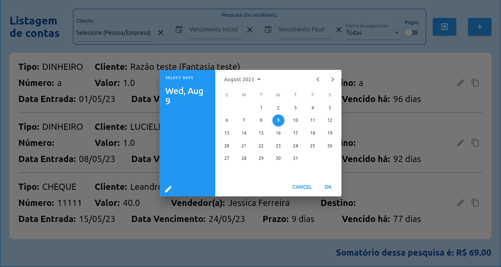
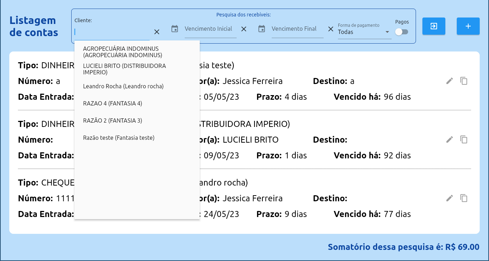
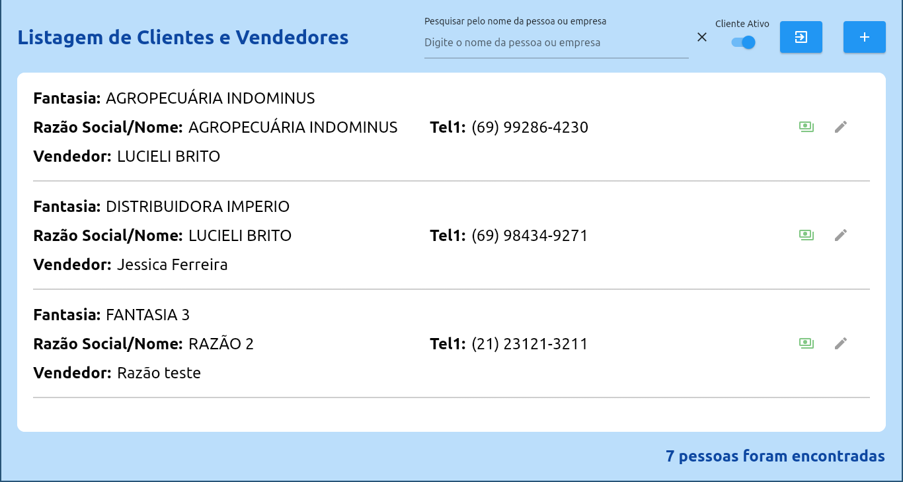
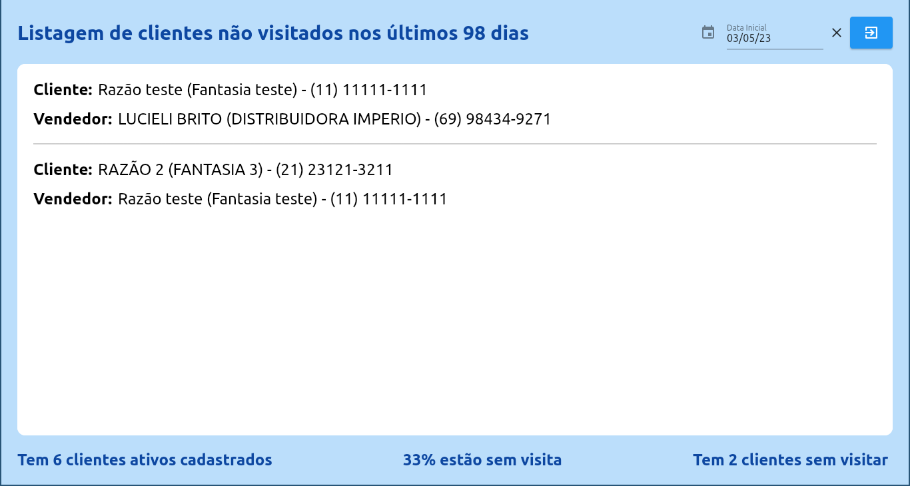

# Register of receivables front 
## Aplicativo desktop para gerenciamento de contas a receber, cadastro de cliente/vendedores e relatórios com diversos filtros customizáveis. 

### Demonstração visual da tela do app

**Packages que utilizei:**

- dio: [link](https://pub.dev/packages/dio)
- provider: [link](https://pub.dev/packages/provider)
- intl: [link](https://pub.dev/packages/intl)
- loading animation widget: [link](https://pub.dev/packages/loading_animation_widget)
- top snackbar flutter: [link](https://pub.dev/packages/top_snackbar_flutter)
- bloc: [link](https://pub.dev/packages/bloc)
- flutter bloc: [link](https://pub.dev/packages/flutter_bloc)
- equatable: [link](https://pub.dev/packages/equatable)
- match: [link](https://pub.dev/packages/match)
- match generator: [link](https://pub.dev/packages/match_generator)
- build runner: [link](https://pub.dev/packages/build_runner)
- validatorless: [link](https://pub.dev/packages/validatorless)
- loading animation widget: [link](https://pub.dev/packages/loading_animation_widget)
- mask text input formatter: [link](https://pub.dev/packages/mask_text_input_formatter)
- cnpj cpf formatter nullsafety: [link](https://pub.dev/packages/cnpj_cpf_formatter_nullsafety)
- date time picker: [link](https://pub.dev/packages/date_time_picker)

## Requisitos

Para executar o aplicativo, os seguintes requisitos devem ser atendidos:

- Flutter 3.10.5
- Dart SDK version: '>=3.0.5 <4.0.0'
- Android SDK (for Android development)

## Começando

Para começar a usar o aplicativo:

1. Clone o repositório e navegue até o diretório do projeto.
2. Instale os pacotes necessários usando `flutter pub get`.
3. Execute o aplicativo `flutter run`

#### Observação:
É necessario ter o backend rodando no localhost na porta 5000, antes de rodar o aplicativo.
